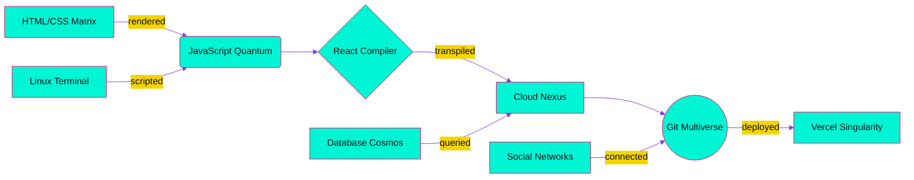

<!--  █████╗ ███╗   ██╗██╗  ██╗ ██████╗ ██████╗ ██████╗ ████████╗
      ██╔══██╗████╗  ██║╚██╗██╔╝██╔═══██╗██╔══██╗██╔══██╗╚══██╔══╝
      ███████║██╔██╗ ██║ ╚███╔╝ ██║   ██║██████╔╝██████╔╝   ██║   
      ██╔══██║██║╚██╗██║ ██╔██╗ ██║   ██║██╔═══╝ ██╔═══╝    ██║   
      ██║  ██║██║ ╚████║██╔╝ ██╗╚██████╔╝██║     ██║        ██║   
      ╚═╝  ╚═╝╚═╝  ╚═══╝╚═╝  ╚═╝ ╚═════╝ ╚═╝     ╚═╝        ╚═╝   -->

<!--  🅳🅴🅰🅳  🅼🅰🅽  🆂🅽🅸🅿🅴🆁  🅰🆄🆃🅾-🆂🅽🅰🅿  🅲🅰🆁🅳  -->
<!--  Auto-re-renders every 60 s via GitHub Actions cron.      -->

  <picture>
    <source media="(prefers-color-scheme: dark)" srcset="https://readme-typing-svg.demolab.com?font=Fira+Code&size=28&duration=4000&pause=1000&color=00F5D4&center=true&vCenter=true&width=600&lines=Alish-0x%20%7C%20Quantum%20Byte%20Surfer">
    
  </picture>

  

---

### 🌀  **Dimensional Dashboard**  *(live)*
| 🪐 CURRENT ORBIT | 🚀 THRUST LEVEL | ⚡ KARMA COLLISION | 🌌 SENTINEL UPTIME |
|:---:|:---:|:---:|:---:|
|  |  |  |  |

---

### 🧬 **Chaotic Skill Genome**

  

  

  

<b>🔭 Expand Quantum Signature</b>

---

### 🕳️ **Event Horizon Timeline**

  

---

### 🧊 **Cryo-Quotes** <!--*(refreshes on every push)*-->
> **“** _“Code is the closest thing to magic that exists, except it actually works.”_ **”**  
> — Alish0x, *Drifting between Qubits*

---

### 🪞 **Mirror Fragment Artifacts**
| | | |
|:---:|:---:|:---:|
|  |  |  |

---

### 🪐 **Cosmic Footer**

  

